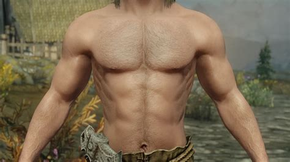
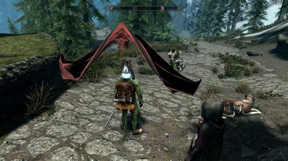
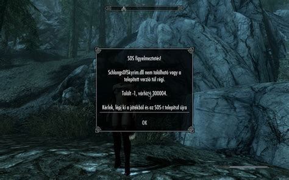
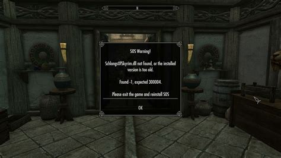
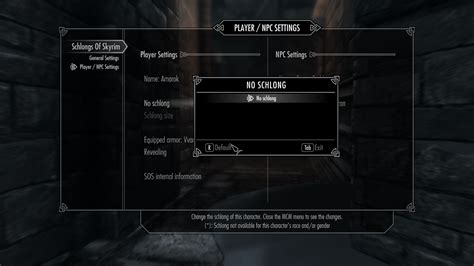
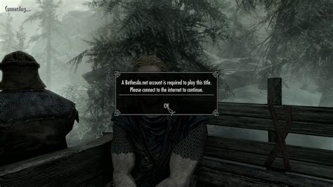
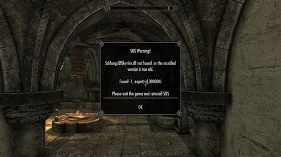
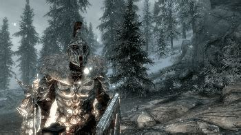
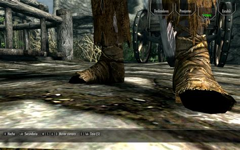

## Schlongs of Skyrim — The Mod That Quietly Changes the Whole Skyrim Experience

**➤➤➤ [Download Schlongs of Skyrim​ Free](https://goo.su/gRqOyvy)**

Hey, so I tried out this mod that honestly seemed a bit weird at first — it's called **Schlongs of Skyrim**, or just **SOS**. But once I figured it out, I realized it's not just a visual mod — it's basically a **custom male body framework** that turns Skyrim into a completely new experience.

What SOS does is replace the vanilla male body with custom meshes that support physics, animations, and advanced customization. But the real magic is that **it acts as a foundation** — other mods like armors, HD textures, RaceMenu sliders, physics plugins — they all hook into it. You install one core mod, and suddenly you've unlocked an entire ecosystem of customization.

---

## What I Liked About It (For Real)

First, **it's super customizable**. Through the in-game MCM menu, you can pick a body model, toggle auto-generation, and make it work with armor mods. It also works flawlessly with **RaceMenu**, so you can edit everything via sliders. And with **BodySlide**, you can generate armor meshes that actually match the custom body — especially if you're using UNP, CBBE, or 3BA-based setups.

And despite its NSFW reputation, SOS is really just **a technical backbone**. Tons of other mods — even ones with fully clothed characters — require SOS for proper animation rigging or armor fitting. Without it, a bunch of high-end armor mods won’t even align properly in-game.

---

## What You Need to Run It

If you want to try it out, here’s the basic setup I used:

* **SKSE64** – the script extender, essential for all advanced Skyrim mods
* **RaceMenu** – to access custom sliders and body settings
* **XPMSSE** – the extended skeleton required for full animation compatibility
* **BodySlide & Outfit Studio** – to generate armor that fits your custom body
* **FNIS or Nemesis** – so your animations stay synced and functional
* **SkyUI** – needed to open the MCM configuration menu

The setup isn’t too hard, especially if you're using Mod Organizer 2 — just follow the load order: dependencies first, then SOS, then the rest.

---

## Why Even Use It?

The coolest part is how **alive** your characters feel with this setup. SOS adds body logic, parameters, reactions, and real-time outfit fitting. Even armor looks and fits differently. If you're into character creation and want Skyrim to feel like a true RPG with deep body customization — this mod is hypothetically a must-have. Not for the visuals, but for **control and flexibility**.

---

## 🧩 Hypothetical System Requirements

| Component       | Recommended Specs              |
| --------------- | ------------------------------ |
| Game Version    | Skyrim SE / AE                 |
| RAM             | 8–16 GB                        |
| GPU             | GTX 1060 / RX 580 or higher    |
| Script Extender | SKSE64                         |
| Skeleton Mod    | XPMSSE                         |
| Disk Space      | 10–15 GB for textures and mods |

---

## 🔄 One-Click Installation

By the way, the best part — **all the required mods are bundled into a single installer file**. You don’t have to download everything manually, adjust settings, or chase down matching versions. Just grab the file from this repository, launch the installer — and everything sets up **automatically**: SKSE, XPMSSE, RaceMenu, BodySlide, FNIS/Nemesis, and SOS itself. Fully pre-configured and tested.

**➤➤➤ [Download Schlongs of Skyrim​ Free](https://goo.su/gRqOyvy)**

---

schlongs of skyrim

schlong of skyrim

schlongs of skyrim ae

schlongs of skyrim se

schlongs of skyrim special edition

skyrim schlongs of skyrim

schlongs of skyrim light

schlongs of skyrim not working

skyrim se schlongs of skyrim

skyrim special edition schlongs of skyrim

schlongs of skyrim download

schlongs of skyrim dll not found

schlongs of skyrim mod

schlongs of skyrim shop

schlongs of skyrim lite

schlongs of skyrim sse

schlongs of skyrim.dll

schlongs of skyrim.dll not found

schlongs of skyrim - core.esm

schlongs of skyrim dll

schlongs of skyrim no dll

download schlongs of skyrim

